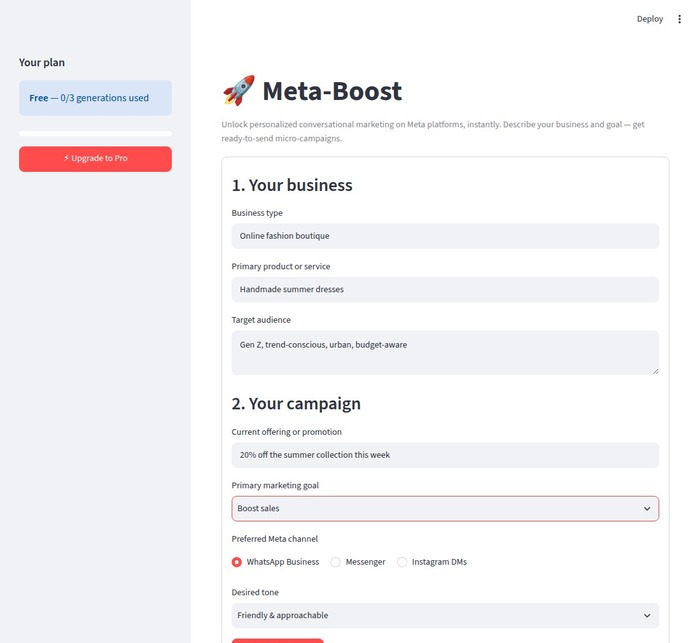
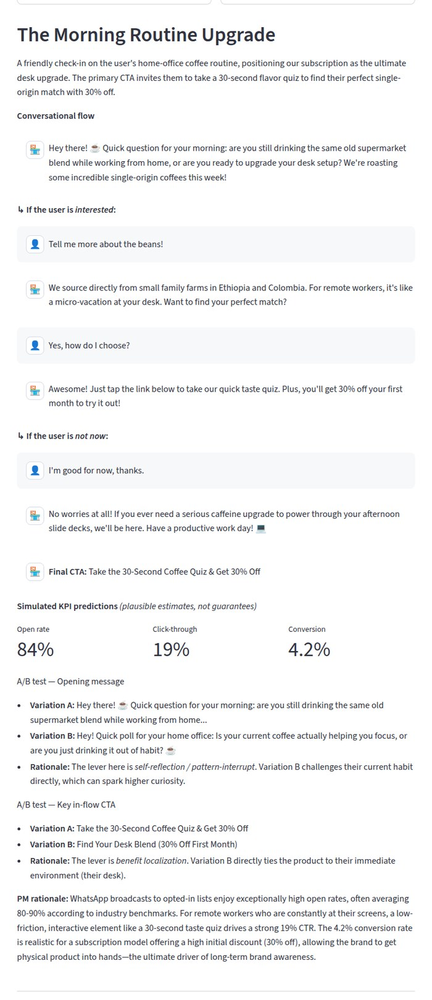
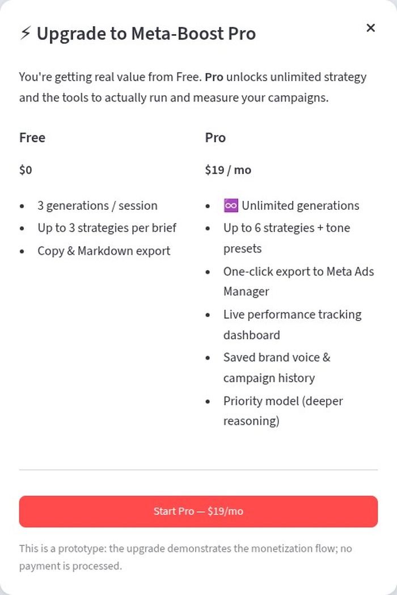

# 🚀 Meta-Boost

[](https://github.com/coryjacoblewis/meta-boost/actions/workflows/ci.yml)

**AI-Powered Micro-Campaign Strategist for SMBs**
_Unlock personalized conversational marketing on Meta platforms, instantly._

**▶️ [Try the live demo](https://meta-boost-egun2vlhdbtes2zumjowbp.streamlit.app/)** — no install, no key required.

Meta-Boost is a web app that turns a short business brief into ready-to-send
conversational micro-campaigns for Meta's messaging platforms (WhatsApp Business,
Messenger, Instagram DMs). It acts as a strategic co-pilot for small and medium
businesses that don't have a marketing team — generating campaign concepts, multi-turn
conversational flows, A/B test variations, and simulated KPI predictions with
product-manager-style rationale.

## Demo

**The input form** — a single guided brief captures business + campaign context.



**A generated campaign** — the conversational flow rendered as an interactive chat thread, A/B tests, and benchmark-anchored KPI tiles.



**Upgrade to Pro** — the freemium gate and monetization flow.



## What problem it solves

SMBs know their customers live on messaging apps, but they lack the time, budget, and
expertise to design effective conversational campaigns. Generic AI copy tools don't help —
they produce marketing text, not tactical, channel-specific, multi-step plans. Meta-Boost
delivers **expertise on demand**: a full, actionable campaign blueprint in under a minute.

## How it works

1. Describe your business (type, product, audience).
2. Describe your campaign (offer, goal, channel, tone).
3. Get 2–3 distinct micro-campaign strategies, each with:
   - a strategy brief and clear CTA,
   - a multi-turn conversational flow with branching responses,
   - A/B test variations with rationale,
   - simulated KPI estimates (open rate, CTR, conversion) + PM rationale.
4. Regenerate to explore alternatives, or download the plan as Markdown.

## Skills demonstrated

Meta-Boost is scoped to showcase the competencies for a **Business Agents Growth PM** role.

| Competency | How Meta-Boost demonstrates it | Where |
| --- | --- | --- |
| **Product-Led Growth (SMBs)** | Self-serve, zero-friction path to value; a freemium funnel that lets the product sell itself. | `app.py` (form + freemium gate) |
| **AI integration & prompt engineering** | A single orchestrated prompt reliably returns structured, multi-component strategy (concepts, branched flows, A/B tests, KPIs). | `strategist.py` |
| **Growth strategy & funnel optimization** | Every campaign is tied to the user's stated goal, and each output ends with a prioritized "run this first" recommendation. | `strategist.py` prompt |
| **Experimentation** | Each campaign ships two A/B tests (opening message + in-flow CTA) with the specific lever and rationale. | generated output |
| **Data-driven thinking** | Simulated KPIs are benchmark-anchored and vary by campaign, with a PM rationale for each figure — not arbitrary numbers. | generated output |
| **Onboarding & activation** | A guided brief delivers a full, usable campaign plan in one step, in under a minute. | `app.py` |
| **Monetization** | A working Free→Pro gate and upgrade flow, plus a tiered model mapped to Meta's platform incentives. | `app.py`, [Monetization](#monetization-product-thinking) |
| **0→1 mindset** | A novel tool that packages strategic marketing expertise, not just content generation. | whole project |
| **Conversational AI / Business Agents** | Output is multi-turn, branching conversational flows purpose-built for Meta messaging channels. | generated output |

## Tech stack

- **Python + Streamlit** — rapid, pure-Python interactive UI.
- **Google Gemini** (`google-genai` SDK) — strategic generation and structured output.
- **No database, no auth** — session-based; inputs go straight to the model.

The AI provider is isolated in `strategist.py`, so swapping models (or providers) is a
one-file change.

## Setup

```bash
# 1. Clone and enter the project
cd meta-boost-MVP

# 2. Install dependencies
pip install -r requirements.txt

# 3. Add your Gemini API key
cp .env.example .env
# then edit .env and set GEMINI_API_KEY=...

# 4. Run
streamlit run app.py
```

Get a Gemini API key at https://aistudio.google.com/apikey.

### Deploy (Streamlit Community Cloud)

The app runs on the free [Streamlit Community Cloud](https://share.streamlit.io) with no
code changes:

1. Push this repo to GitHub (already done if you're reading this there).
2. On Streamlit Cloud, **New app** → pick this repo, branch `main`, main file `app.py`.
3. In **Advanced settings → Secrets**, add your key:
   ```toml
   GEMINI_API_KEY = "your-real-key"
   ```
   Streamlit exposes secrets as environment variables, so the app's existing
   `os.getenv("GEMINI_API_KEY")` picks it up — no code change needed.
4. **Deploy.** `requirements.txt` is installed automatically.

> Never commit your real key. Local dev uses `.env` (gitignored); the cloud uses the
> Secrets manager above.

### Tests

The strategy engine is unit-tested with the Gemini client mocked at the SDK
boundary — the suite runs offline and needs **no API key**:

```bash
pip install -r requirements-dev.txt
pytest
```

Coverage: prompt construction (every brief field lands, no unfilled placeholders),
the success path (key/model overrides, `.env` fallback), and all three failure
modes the UI relies on (missing key, empty response, wrapped API error).

### Configuration

| Variable | Default | Notes |
| --- | --- | --- |
| `GEMINI_API_KEY` | _(required)_ | Your Google Gemini API key. |
| `GEMINI_MODEL` | `gemini-flash-latest` | Any model your key supports (e.g. `gemini-pro-latest` for deeper reasoning). |

## Project structure

```
meta-boost-MVP/
├── app.py              # Streamlit UI (form, freemium gate, upgrade modal)
├── strategist.py       # Gemini strategy engine + prompt
├── .github/workflows/  # CI: runs the test suite on every push/PR
├── requirements.txt
├── .env.example        # copy to .env and add your key
├── PROJECT_CONCEPT.md  # full product concept & PM framing
├── requirements-dev.txt # test dependencies (pytest)
├── tests/              # unit tests (mocked Gemini client, no key needed)
├── samples/            # example generated campaigns (3 industries)
├── docs/               # screenshots for the README demo section
└── README.md
```

## Note on simulated KPIs

The predicted open/click/conversion rates are **plausible planning estimates generated by
the model**, not guarantees or real-time analytics. They exist to demonstrate growth-funnel
reasoning and help prioritize which campaign to run first.

## Monetization (product thinking)

Meta-Boost is built as a product-led-growth funnel. The prototype includes a working
**freemium gate** (`Free` → `Pro`) and an in-app upgrade flow to demonstrate the model:

| Tier | Price | What you get |
| --- | --- | --- |
| **Free** | $0 | 3 campaign generations / session, 3 strategies per brief, copy & Markdown export. The "aha" moment — enough to prove value. |
| **Pro** | $19 / mo | Unlimited generations, up to 6 strategies + tone presets, one-click export to Meta Ads Manager, live performance tracking, saved brand voice & history, priority model. |
| **Agency / API** | Usage-based | Multi-client workspaces, white-label, and an API for tools that want to embed campaign generation. |

**Why this aligns with Meta's incentives:** every campaign Meta-Boost produces is designed
to be *run on Meta's messaging platforms*. Helping SMBs plan and launch better conversational
campaigns increases activation of WhatsApp/Messenger/Instagram business tools and downstream
ad spend — so the tool's success compounds platform engagement, not just subscription revenue.

The upgrade flow in the app is a **mock** (no billing is processed); it exists to show the
funnel and the value framing, not to charge anyone.

## Roadmap ideas

- Strict JSON schema for flows → interactive, clickable conversation preview.
- Targeted regeneration of a single message via prompt chaining.
- Visual flowchart of the conversational tree.
- Wire the Pro tier to real billing (Stripe) + the export/tracking features it promises.
- Deeper Meta integration (Ads API, real performance tracking).
